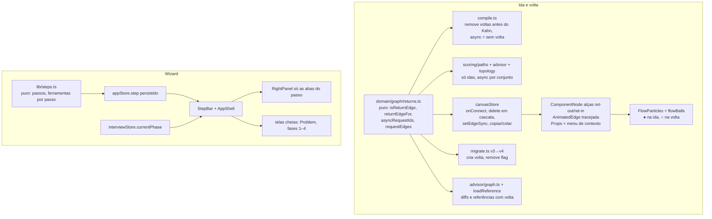

# Interface guiada e ida/volta — Design

**Spec**: `.specs/features/guided-ui/spec.md`
**Status**: Done

---

## Architecture Overview

Duas mudanças independentes que só se encontram no `app-shell`: (1) o modelo de aresta ganha a **volta** (schema v4) e (2) um **passo** decide que ferramentas aparecem. O motor não muda: `compileGraph` continua entregando o mesmo `SimGraph`, só que `async` passa a ser derivado da ausência da volta.



**Abordagem escolhida (recomendada)**: a volta é uma aresta ReactFlow comum com `data.responseTo = <id da ida>`, id `ret:<id da ida>`, `source`/`target` invertidos e alças `ret-out` (no alvo) / `ret-in` (em quem chamou). Alternativas descartadas: (a) o flag `async` continuar como fonte de verdade e a volta ser só desenho derivado: viola a decisão da spec ("uma fonte de verdade"); (b) a volta como campo `edge.data.response` da ida, desenhada como segunda curva pelo `AnimatedEdge`: não deixa "desenhar à mão" nem selecionar a volta sozinha (RET-01, RET-11).

---

## Code Reuse Analysis

### Existing Components to Leverage

| Component                                        | Location                                          | How to Use                                                                                         |
| ------------------------------------------------ | ------------------------------------------------- | -------------------------------------------------------------------------------------------------- |
| `migrateGraph` chain                             | `domain/persistence/migrate.ts`                   | Acrescentar `migrateGraphV3toV4` ao fim; mesma forma (pura, idempotente, nunca lança)              |
| `newEdgeData` / `splitReadsOnReplicaConnect`     | `domain/graph/edgeRules.ts`                       | `onConnect` pela alça de ida continua igual; só deixa de gravar `async`                            |
| `applyGraphEdit`, `GraphDiff`, `insertBetween`   | `store/canvasStore.ts`, `advisor/graph.ts`        | O diff passa a carregar as voltas; um único ponto cria "ida + volta"                               |
| `buildReferenceGraph`                            | `lib/loadReference.ts`                            | Cria `ret:` para cada aresta de referência sem `async`                                             |
| `instanceGraph` (`instanceEdgeId`)               | `components/canvas/instanceGraph.ts`              | A cópia da volta por card segue a regra da cópia da ida                                            |
| `topologySignature`                              | `lib/topology.ts`                                 | Já inclui `isAsyncEdge`; passa a incluir as voltas (a assinatura muda quando a volta aparece/some) |
| `PARAM`/RightPanel `Tabs`                        | `components/panel/RightPanel.tsx`                 | Filtrar `TabsTrigger` pela lista do passo em vez de render fixo                                    |
| `InterviewBar` stepper                           | `components/interview/InterviewBar.tsx`           | Vira a mesma `StepBar` com os 6 passos da entrevista                                               |
| `ModalShell`, `useIsMobile`, `paddingAboveSheet` | `components/dialogs`, `hooks`, `lib/placement.ts` | Sem mudança                                                                                        |
| `safeLocalStorage` + `STORE_VERSION`             | `store/persistVersion.ts`                         | `appStore.step` persiste; versão sobe com `SCHEMA_VERSION`                                         |

### Integration Points

| System              | Integration Method                                                                              |
| ------------------- | ----------------------------------------------------------------------------------------------- |
| Motor (`engine/`)   | Nenhuma mudança. `compileGraph` é o único ponto que lê voltas; `SimEdge.async` = idas sem volta |
| `runtimeStore`      | Métricas continuam por id da ida; a volta lê as da ida (`returnEdge.data.responseTo`)           |
| `chaosStore`/faults | Faults ficam na ida (AD-001); a volta nunca é alvo                                              |
| `edge.selected`     | A volta selecionada aparece em Props como "Response to A → B"                                   |

---

## Components

### returns (puro)

- **Purpose**: única fonte do que é uma volta e de como ela deriva da ida.
- **Location**: `src/domain/graph/returns.ts`
- **Interfaces**:
  - `isReturnEdge(e): boolean` — `data.responseTo` é string
  - `returnIdOf(requestId): string` — `ret:${requestId}`
  - `makeReturnEdge(request: Edge): Edge` — source/target invertidos, handles `ret-out`/`ret-in`, `type: "animated"`, `data.responseTo`
  - `requestEdges(edges): Edge[]` — sem as voltas
  - `responseOf(edges): Map<requestId, Edge>`
  - `asyncRequestIds(edges): Set<string>` — idas sem volta
  - `withReturns(edges, isAsync?): Edge[]` — acrescenta a volta de cada ida que não é async (usado pela migração, pelo loader e pelos diffs)
- **Dependencies**: só tipos do `@xyflow/react`.
- **Reuses**: nada; substitui `isAsyncEdge` (que passa a delegar a `asyncRequestIds`).

### Compile

- **Purpose**: o compilador ignora voltas e deriva `async`.
- **Location**: `src/domain/graph/compile.ts`
- **Interfaces**: `compileGraph(nodes, edges)` — mesma assinatura; antes do loop de arestas, separa voltas; `SimEdge.async = !responses.has(edge.id)`. O flag legado `data.async === true` ainda força async (grafos v3 que ainda não passaram pela migração, ex.: payloads externos); voltas sem ida viram aviso.
- **Dependencies**: `returns.ts`.

### Persistência v4

- **Purpose**: schema 4.
- **Location**: `src/domain/persistence/{version,migrate,serialize,envelope}.ts`
- **Interfaces**: `migrateGraphV3toV4(nodes, edges)`; `serializeEdges` grava `responseTo` e não grava `async`; `importDesign` descarta volta órfã com aviso (RET-32); export `schemaVersion: 4`.

### Edição (store)

- **Purpose**: criar/apagar volta com uma entrada de undo.
- **Location**: `src/store/canvasStore.ts`
- **Interfaces**:
  - `onConnect(connection)` — `sourceHandle === "ret-out"`: cria a volta se existir ida alvo→origem sem volta; senão toast (RET-02) ou nada (RET-03, RET-30); qualquer outra conexão nasce sem volta.
  - `setEdgeSync(requestId, sync: boolean)` — atalho Sync/Async (RET-12/13), em `MUTATING_ACTIONS`.
  - `deleteSelection` — apagar uma ida apaga a volta; a volta sozinha pode ser apagada (a ida vira async).
  - `selectionSubgraph`/`cloneSubgraph` — a volta vai junto quando os dois nós foram copiados.
  - `updateEdgeData(id, { async })` deixa de existir (nenhum chamador sobra).

### Canvas

- **Purpose**: desenhar duas linhas e as alças de volta.
- **Location**: `ComponentNode.tsx`, `InstanceNode.tsx`, `edges/AnimatedEdge.tsx`, `DesignCanvas.tsx`, `instanceGraph.ts`, `FlowParticles.tsx`, `lib/flowBalls.ts`, `lib/particles.ts`
- **Interfaces**: alças `ret-out` (source, `Position.Left`, abaixo da de entrada) e `ret-in` (target, `Position.Right`, abaixo da de saída), escondidas em aba somente leitura; a ida mantém `source`/`target` padrão. `AnimatedEdge` pinta a volta tracejada, seta em quem chamou, cor e largura lidas da ida. `flowBalls` recebe um mapa `requestEdgeId → returnEdgeId` e põe a bola `res` no caminho da volta (hoje `len − pos` na ida).

### Painel e menu

- **Purpose**: volta selecionada em Props; Sync/Async.
- **Location**: `RightPanel.tsx` (aba Props), `CanvasContextMenu.tsx`, `EdgeCallsForm.tsx`
- **Interfaces**: `ResponseInfo` — "Response to A → B" + botão "Select request"; Sync/Async chamam `setEdgeSync`; desabilitados em aba de referência (RET-17).

### Wizard (puro + store)

- **Purpose**: o passo atual define as ferramentas.
- **Location**: `src/lib/steps.ts`, `src/store/appStore.ts`
- **Interfaces**:
  - `STEPS = ["problem","design","simulate","failures","evaluate"]`; `TOOLS_BY_STEP: Record<Step, RightTab[]>`; `canvasVisible(step)`, `paletteVisible(step)`
  - `appStore.step`, `setStep`, `nextStep`, `backStep`, `goToStep(i)` (só anterior ou atual); persistido
  - `interviewStepOf(phaseIndex)`: fases 0–3 → tela cheia; 4 → ferramentas de Design+Simulate; 5 → drill

### UI do wizard

- **Purpose**: barra de passos, telas cheias, painel filtrado.
- **Location**: `components/layout/StepBar.tsx`, `components/layout/ProblemStep.tsx`, `components/layout/app-shell.tsx`, `components/panel/RightPanel.tsx`, `components/sidebar/Sidebar.tsx`, `components/interview/InterviewBar.tsx`, `components/interview/InterviewPhasePanel.tsx`
- **Interfaces**: `StepBar` (desktop: rótulos clicáveis só para passos anteriores; < 768 px: nome, "n / total", Back/Next); `ProblemStep` (seletor, enunciado, Capacity, Learning Path em tela cheia); `AppShell` esconde canvas/paleta conforme o passo ou a fase; `RightPanel` mostra só `TOOLS_BY_STEP[step]` e corrige `activeRightTab` fora da lista; `Walkthrough`/`HowItWorks` passam a apontar para a barra.

---

## Data Models

```typescript
// Aresta no canvas (v4). A ida não muda; a volta é uma aresta própria.
interface ReturnEdgeData {
  responseTo: string; // id da ida; fonte única de "síncrona"
  label?: "";
  protocol?: string; // ignorados; nada editável
}
// Ida: data.async deixa de existir no formato salvo.

// SCHEMA_VERSION = 4; Envelope v4:
// { schemaVersion: 4, name, problemId, nodes, edges /* idas + voltas */, strokes, chaosScript?, slo? }

// appStore (persistido)
interface WizardState {
  step: "problem" | "design" | "simulate" | "failures" | "evaluate";
}
```

**Relationships**: `ret:<id>` ↔ `responseTo: <id>` (1 para 0..1). A volta guarda `source = ida.target`, `target = ida.source`; se a ida for apagada ou mudar de nó, a volta cai junto (sempre derivável).

---

## Error Handling Strategy

| Error Scenario                         | Handling                                                                | User Impact                  |
| -------------------------------------- | ----------------------------------------------------------------------- | ---------------------------- |
| Volta sem ida (import, edição externa) | `compileGraph` ignora com aviso; `importDesign` descarta com `warnings` | Design abre sem a linha órfã |
| Conexão pela alça de volta sem ida     | Nenhuma aresta; toast "A response needs a request: connect A → B first" | Mensagem clara               |
| Volta duplicada                        | Nenhuma aresta, nenhum undo                                             | Nada acontece                |
| `step` persistido inválido             | `sanitizeStep` volta a `problem`                                        | Reabre no início             |
| Fase da entrevista fora do intervalo   | Já tratado por `setPhase`/`merge` do `interviewStore`                   | Sem mudança                  |

---

## Risks & Concerns

| Concern                                                                                                                        | Location (file:line)                                                                                                     | Impact                                                       | Mitigation                                                                                                                                                                   |
| ------------------------------------------------------------------------------------------------------------------------------ | ------------------------------------------------------------------------------------------------------------------------ | ------------------------------------------------------------ | ---------------------------------------------------------------------------------------------------------------------------------------------------------------------------- |
| Quase todo teste de motor monta arestas "à mão" sem volta; sob o novo `compileGraph` elas ficariam async e os números mudariam | `tests/unit/engineFixtures.ts:36` (`wire`), 94 chamadas de `compileGraph` em `tests/unit/`                               | Falha em massa ou, pior, teste verde com assert enfraquecido | T4 troca `wire` por um par ida+volta (`wirePair`) mantendo `async: true` ⇒ sem volta; o golden (`engine-golden.test.ts`) passa por `migrateGraph` e não pode mudar o fixture |
| 62 arestas `async: true` em `problems.ts` e o loader grava o flag                                                              | `src/lib/loadReference.ts:73`, `src/data/problems.ts`                                                                    | Referências virariam sync/async trocadas                     | O campo `async` do tipo `Problem` fica (é dado de referência); só o loader o converte em "sem volta"                                                                         |
| `isAsyncEdge(e)` é chamado por aresta, sem contexto do grafo (advisor, scoring, topologia)                                     | `advisor/load.ts:138`, `advisor/patterns.ts:61`, `scoring/paths.ts:53`, `lib/topology.ts:22`, `advisor/mitigation.ts:50` | A volta entraria na adjacência e criaria ciclo               | T6 troca por `asyncRequestIds(edges)` e `requestEdges(edges)` num único passe; `ScoringGraph` só recebe idas                                                                 |
| `canvasStore` tem lista fechada de ações (`MUTATING_ACTIONS`)                                                                  | `store/canvasStore.ts:793`                                                                                               | Ação nova fora das listas quebra `editor.test.ts`            | `setEdgeSync` entra em `MUTATING_ACTIONS` na mesma task                                                                                                                      |
| Bolas de resposta usam `len − pos` da ida                                                                                      | `lib/flowBalls.ts:602`                                                                                                   | Bolas ○ continuariam na linha da ida                         | T21 passa o mapa ida→volta e testa que nenhuma `res` anda na ida                                                                                                             |
| Teste de largura da top bar mede com todos os chips; a StepBar tira controles dela                                             | `tests/e2e/smoke.spec.ts`                                                                                                | Falso verde/vermelho                                         | Controles ficam na top bar; só a StepBar nova ocupa linha própria                                                                                                            |
| `app-shell.tsx` (506 linhas) concentra layout, diálogos e atalhos                                                              | `components/layout/app-shell.tsx`                                                                                        | Mais lógica numa classe já grande                            | O layout por passo sai para `StepLayout` (T27); o shell só escolhe                                                                                                           |

---

## Tech Decisions

| Decision                       | Choice                                                                                                | Rationale                                                                                                |
| ------------------------------ | ----------------------------------------------------------------------------------------------------- | -------------------------------------------------------------------------------------------------------- |
| Id da volta                    | `ret:<id da ida>` determinístico                                                                      | Quick fixes, undo e testes precisam de ids estáveis (regra do advisor: ids nunca aleatórios)             |
| Flag `async` em `compileGraph` | Legado `data.async === true` continua forçando async                                                  | Payloads v3 que ainda não migraram (ex.: testes antigos) não mudam de significado; v4 nunca grava o flag |
| Posição das alças              | `ret-out` à esquerda, `ret-in` à direita, abaixo das principais                                       | A volta nasce de onde a ida chega e desenha uma curva paralela                                           |
| Props da volta                 | Somente leitura                                                                                       | Spec: o link vive na ida (AD-001)                                                                        |
| Passo persistido               | `appStore.step`                                                                                       | A fase da entrevista já persiste em `interviewStore`; o passo do modo livre é setting de UI              |
| Troca de passo                 | Só muda `appStore.step`; nunca toca `canvasStore`, `runtimeStore` nem `SimController`                 | WIZ-11                                                                                                   |
| Abas fora do passo             | `RightPanel` mantém o `Tabs` e filtra os triggers; a aba ativa fora da lista cai na primeira do passo | Menor diff; os painéis lazy continuam montados sob demanda                                               |

> **Decisões de projeto** a registrar em `.specs/STATE.md`: AD-003 (a volta é uma aresta própria; `async` é derivado) e AD-004 (o passo/fase decide as ferramentas; trocar de passo nunca edita o grafo nem a execução).

---

## Tips

- Cada task de código fecha com `npm run typecheck` + testes do que tocou; a última de cada fase roda `npm run lint`, `npm test` e `npm run build`.
- Mudança visual (alças, linhas, passos, telas cheias) é exercitada no navegador antes de marcar a task como concluída, além do Playwright.
