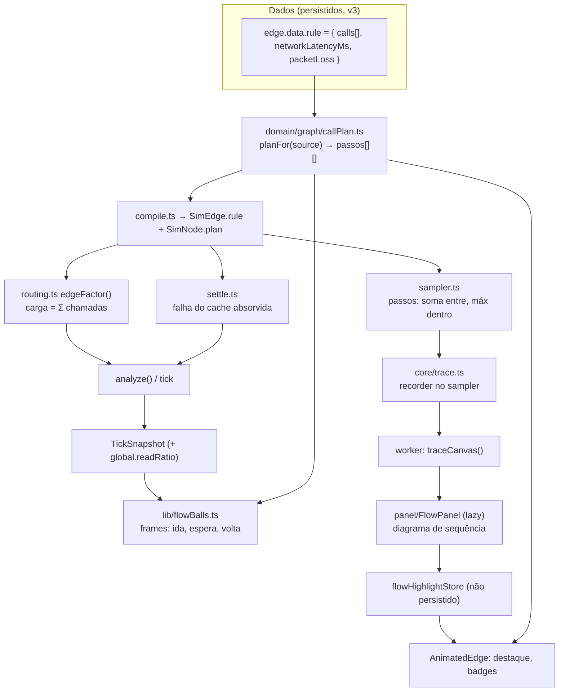

# Fluxo da requisição — Design

**Spec**: `.specs/features/request-flow/spec.md`
**Context**: `.specs/features/request-flow/context.md`
**Status**: Draft

---

## Architecture Overview

A aresta deixa de ser "uma regra" e passa a ser **um link com uma lista de chamadas**. O link guarda o que é da rede (latência, perda de pacote) e continua sendo a unidade de fault, de blast radius e de métrica no canvas. Cada chamada guarda o que é de quem chama: a condição, o passo e quantas vezes por requisição.

Um módulo puro novo, `domain/graph/callPlan.ts`, resolve para cada nó o **plano de chamadas**: a lista de passos com as chamadas de cada um, com os passos implícitos preenchidos, a dependência "após miss" ligada à chamada ao cache e os avisos. O compilador, o motor, as bolinhas, o trace e os badges leem o mesmo plano, então nenhum deles reinterpreta a ordem por conta própria.



### Abordagens consideradas

| Abordagem                                                   | Como                                                                                                                                           | Por que não / por que sim                                                                                                                                                |
| ----------------------------------------------------------- | ---------------------------------------------------------------------------------------------------------------------------------------------- | ------------------------------------------------------------------------------------------------------------------------------------------------------------------------ |
| **A. Link + lista de chamadas na mesma aresta (escolhida)** | `EdgeRule` vira `{ calls, networkLatencyMs, packetLoss }`. A carga da aresta é a soma das chamadas; a falha e a latência continuam por aresta. | Faults, blast radius, métricas, cards de instância e ids de aresta não mudam. Só o roteamento, o settle e o sampler passam a iterar chamadas.                            |
| B. Uma `SimEdge` por chamada no compilador (`edgeId#i`)     | O motor quase não muda, mas cada chamada vira uma aresta própria.                                                                              | Runtime metrics, faults (`effects.edges`), blast e `flowBalls` usam o id da aresta do canvas; tudo precisaria agregar de volta. Mais churn e mais chance de divergência. |
| C. Permitir duas arestas A → B no canvas                    | Uma linha "escritas" e outra "leituras após miss".                                                                                             | Recusada no Specify (linha 5 das premissas): ilegível, e o compilador deduplica arestas paralelas.                                                                       |

---

## Code Reuse Analysis

### Existing Components to Leverage

| Component                                                                                       | Location                                                       | How to Use                                                                                                            |
| ----------------------------------------------------------------------------------------------- | -------------------------------------------------------------- | --------------------------------------------------------------------------------------------------------------------- |
| `sanitizeEdgeRule`, `defaultEdgeRule`, `connectEdgeRule`, `edgeRuleBadge`, `applyEdgeRulePatch` | `src/domain/graph/edgeRules.ts`                                | Estender para o formato com `calls`; o sanitize aceita também o formato v2 achatado (defesa extra além da migração).  |
| `ruleProbability`, `callsOf`, `ruleFactor`                                                      | `src/engine/core/routing.ts:69-90`                             | `ruleProbability` vira `callProbability(call, …)`; `ruleFactor` vira `edgeFactor(edge, …)` = Σ das chamadas.          |
| Ponto fixo de retries                                                                           | `src/engine/analyze.ts:163-311`                                | Também liga quando há chamada "após miss": a probabilidade depende da falha da chamada ao cache, que sai do `settle`. |
| Retries entre ticks (`pending`)                                                                 | `src/engine/core/tick.ts:413-427`                              | Mesmo padrão: o tick guarda a `failure` do tick anterior para as chamadas "após miss".                                |
| `settle()` / `sampleNodesFor()`                                                                 | `src/engine/core/settle.ts`                                    | Compartilhados por `analyze()` e pelo tick (não fazer fork); passam a ler o plano.                                    |
| `sampleLatency()`                                                                               | `src/engine/core/sampler.ts`                                   | Ganha passos e um `Recorder` opcional; o trace usa o mesmo código.                                                    |
| Tipo `Trace` (OBS-06, ainda sem uso)                                                            | `src/engine/types.ts:190`                                      | Substituído por `RequestTrace` com eventos de chamada/resposta; a aba Fluxo cumpre o OBS-06 da Spec 07.               |
| `migrateGraphV1toV2`, `migrateCanvasState`, `migrateSavedDesignsState`                          | `src/domain/persistence/migrate.ts`, `src/store/migrations.ts` | Encadear v2 → v3 depois da v1 → v2, no mesmo ponto de entrada.                                                        |
| `updateEdgeRule` (já em `MUTATING_ACTIONS`)                                                     | `src/store/canvasStore.ts:284,640-660`                         | Continua sendo a única ação de edição; o patch passa a poder trazer `calls`.                                          |
| `readCacheDiff` (fix "add cache")                                                               | `src/advisor/patterns.ts:94-150`                               | Passa a construir o look-aside (sem a aresta cache → banco).                                                          |
| `buildReferenceGraph`                                                                           | `src/lib/loadReference.ts:40-80`                               | Resolve `missOf` dado por componentId na referência para o id do nó.                                                  |
| `ParamsForm` + `EDGE_RULE_SPECS`                                                                | `src/components/panel/ParamsForm.tsx`, `edgeRules.ts:240-310`  | Continua para os campos do link; cada chamada usa um `ParamsForm` com `EDGE_CALL_SPECS`.                              |
| `useEdgeRuntime`, padrão de seletor por entidade                                                | `src/store/runtimeStore.ts`                                    | Mesmo padrão para `useFlowHighlight(edgeId)`.                                                                         |
| `AnimatedEdge` (async já tracejado)                                                             | `src/components/canvas/edges/AnimatedEdge.tsx:85-91`           | FLW-04 já é atendido; só os badges de passo e de condição são novos.                                                  |
| `simulateCanvas` / worker Comlink                                                               | `src/engine/client.ts:125`, `src/engine/worker.ts`             | `traceCanvas()` segue o mesmo caminho lazy.                                                                           |

### Integration Points

| System                         | Integration Method                                                                                                                                                                                                      |
| ------------------------------ | ----------------------------------------------------------------------------------------------------------------------------------------------------------------------------------------------------------------------- |
| Motor (analyze, tick, sampler) | `SimEdge.rule.calls` + `SimNode.plan`, gerados pelo `compileGraph` a partir do `callPlan`.                                                                                                                              |
| Faults (Spec 08)               | Sem mudança no tick. `faults/catalog.ts:166` (`writeShareOf`) passa a ponderar pelas chamadas da aresta. Um cache derrubado faz a falha da chamada ao cache ir a 1, e o ponto fixo manda as leituras ao banco (FLW-13). |
| Persistência (Spec 05)         | `SCHEMA_VERSION` 2 → 3; `STORE_VERSION` acompanha; envelope aceita 1, 2 e 3.                                                                                                                                            |
| Advisor (Spec 12)              | O fix "add cache" e `insertBetween` geram `calls`; `advisorStore` já assina o grafo por `JSON.stringify(rule)` e continua funcionando.                                                                                  |
| Runtime (Spec 07)              | `TickSnapshot.global.readRatio` (novo) para as bolinhas sortearem leitura ou escrita; `extra.hitRatio` (já existe, ciente de faults) para hit/miss.                                                                     |
| CLAUDE.md / `claude-map` test  | Arquivos novos entram no mapa de arquitetura (o teste `claude-map` falha se faltar).                                                                                                                                    |

---

## Components

### `callPlan` (novo, puro)

- **Purpose**: Resolver, para um nó, a ordem e as dependências das chamadas que ele faz.
- **Location**: `src/domain/graph/callPlan.ts`
- **Interfaces**:
  - `planFor(sourceId: string, outEdges: readonly PlanEdge[], targetHasHitRate: (nodeId) => boolean): CallPlan`
  - `MAX_EDGE_CALLS = 8`, `MAX_CALL_STEP = 20` (FLW-49; reexportados por `edgeRules.ts`, que é onde a spec os cita)
- **Regras**:
  1. As chamadas são percorridas em ordem: arestas na ordem do grafo e, dentro de cada aresta, na ordem da lista.
  2. Sem nenhum passo explícito no nó, a chamada na posição i fica no passo i + 1. Assim um design v2 continua 100% sequencial, como o sampler faz hoje.
  3. Com algum passo explícito, as chamadas sem passo vão depois do maior passo explícito, uma por passo, na ordem do item 1.
  4. Uma chamada "após miss" com `missOf = C` exige uma chamada síncrona do mesmo nó para C, e C precisa ter `hitRate`. Senão, ela vira "leituras" e gera um aviso (FLW-42/43).
  5. O passo efetivo da chamada "após miss" é `max(passo, passo(dependência) + 1)`; se precisou subir, gera um aviso (FLW-29).
  6. LB e fila ignoram passos: o LB divide e a fila desacopla.
- **Dependencies**: nenhuma (só tipos).
- **Reuses**: ordem de `forwardEdges` (`routing.ts:171`).

### `edgeRules.ts` (estendido)

- **Purpose**: Formato, padrões, sanitização e formulário das chamadas.
- **Interfaces**:
  - `sanitizeEdgeRule(raw, fallback): EdgeRule`: aceita v3 (`calls`) e v2 achatado (`kind` no topo vira `calls: [{…}]`). Limita a `MAX_EDGE_CALLS` e o passo a `1..MAX_CALL_STEP`, troca condição desconhecida por `always` e devolve avisos por um callback opcional (FLW-45).
  - `defaultEdgeRule(...)`: continua igual e devolve uma lista com uma chamada.
  - `connectEdgeRule(...)`: se a fonte é um serviço, o alvo é um banco e a fonte já tem uma chamada síncrona a um nó com `hitRate`, devolve `[writes, after_miss(missOf: cache)]` (FLW-24).
  - `EDGE_CALL_SPECS` (condição, fração, passo, chamadas por requisição) e `EDGE_LINK_SPECS` (latência, perda).
  - `edgeCallsBadge(rule, labelOf)`: rótulo curto, ex. `"writes · miss: Redis"`.
  - `migrateEdgeRuleV2toV3(raw): unknown`: puro e idempotente.
- **Reuses**: `clamp`, `RULE_KINDS`, `PROTOCOL_LATENCY_MS`.

### Motor: roteamento, settle e ponto fixo

- **Location**: `src/engine/core/routing.ts`, `settle.ts`, `analyze.ts`, `tick.ts`, `faults/catalog.ts`
- **Interfaces**:
  - `callProbability(call, source, ctx: { readRatio, byId, failure }): number`:
    - `reads` → r; `writes` → 1 − r; `fraction` → f; `on_miss` (read-through) → 1 − hitRate(source); `always` → 1.
    - `after_miss` → r × (1 − hitRate(C) × (1 − failure(B → C))). Com C fora, a falha é 1 e a probabilidade é r (FLW-09/12/13).
  - `edgeFactor(edge, source, ctx): number` = Σ `callProbability × callsOf`. Com uma chamada só, o resultado é exatamente o `ruleFactor` de hoje (bit-idêntico).
- **analyze**: o ponto fixo roda se `retrying || hasAfterMiss(graph)`, com o mesmo critério de convergência e o mesmo aviso.
- **tick**: `this.lastFailure` (falha do tick anterior) entra no `ctx`. No primeiro tick vale 0. Determinístico.
- **settle**:
  - Para cada chamada síncrona com probabilidade q, `s *= 1 − q + q·callOk(e)^k` e `a *= 1 − q + q·avail(target)`.
  - A chamada a um cache C referenciado por uma "após miss" do mesmo nó não multiplica `s` nem `a`, porque a falha dela vira miss (FLW-12).
  - Sem chamadas "após miss", o resultado é o de hoje.
- **catalog**: `writeShareOf(e)` passa a ser a média das chamadas da aresta ponderada pela probabilidade de cada uma, com `writes` = 1, `reads`/`on_miss`/`after_miss` = 0 e o resto = 1 − r.

### Sampler + trace

- **Location**: `src/engine/core/sampler.ts`, `src/engine/core/trace.ts` (novo)
- **Interfaces**:
  - `SampleNode.steps: SampleCall[][]` substitui `edges`; o LB mantém `edges` com `share`.
  - `SampleCall = { edgeId, target, kind, fraction, callsPerRequest, networkLatencyMs, packetLoss, missOf? }`.
  - `SampleNode.asyncCalls: SampleCall[]`: só para o trace; o sampler nunca lê, então não consome números aleatórios.
  - `sampleLatency(model, samples, rng, slowerThanMs?, recorder?)`.
  - `traceRequest(model, seed, index, cls: "read" | "write"): RequestTrace`.
- **Comportamento por passo**:
  - Cada chamada do passo roda como hoje (decide se é feita, sorteia a contagem e faz as tentativas). O tempo do passo é o máximo entre as chamadas (FLW-27).
  - Se uma chamada síncrona falha, o passo termina e a requisição falha (FLW-28). A exceção é a chamada a um cache referenciado: a falha vira miss.
- **"após miss"**: a chamada é feita se a requisição é de leitura e a chamada a C falhou ou `rng() < 1 − hitRate(C)`. O sorteio só acontece em nós que têm uma chamada "após miss" (FLW-10/11).
- **Bit-identidade (FLW-32)**: com passos implícitos, cada passo tem uma chamada e a sequência de sorteios é a mesma do loop atual por aresta: `fraction`, depois a contagem, depois as tentativas. Um teste trava isso com as 35 referências na versão anterior.
- **Recorder**: `onCall` / `onReturn` / `onAsync` / `onCacheResult`, com `t0`/`t1` relativos ao início da requisição. No caminho de amostragem normal o recorder é `undefined` (um `if`, sem custo de alocação).

### Worker: `traceCanvas`

- **Location**: `src/engine/client.ts`, `src/engine/worker.ts`
- **Interface**: `traceCanvas(nodes, edges, { rps, config, cls, index }): Promise<RequestTrace & { warnings: string[] }>`. Compila, roda o `analyze()` na carga pedida e chama `traceRequest`.
- **Carga usada**: o `offeredRps` do último snapshot, se existir. Senão, 1 req/s, e a UI esconde os tempos (FLW-36/37).

### `flowBalls` (reescrito em torno de frames)

- **Location**: `src/lib/flowBalls.ts`, `src/components/canvas/FlowParticles.tsx`
- **Modelo**:
  - Cada bola de requisição que chega a um nó abre um **frame** `{ id, node, lane, key, read, caller?: { ball edge, drawn, lane, frameId }, plan, step, pending, failed, cacheMiss: Map }`.
  - O frame lança as chamadas do passo atual: as síncronas como bolas `dir: "req"` ligadas ao frame, as async sem frame.
  - Quando `pending` chega a 0, o frame passa ao próximo passo. Depois do último, devolve uma bola `dir: "res"` pelo mesmo `drawn`, em sentido inverso, até o frame de quem chamou (FLW-01). No nó de entrada, sem quem chamou, o frame fecha (FLW-06).
- **Ramificação por requisição**:
  - A bola nasce leitura com probabilidade `snap.global.readRatio`.
  - `reads`/`writes` seguem a classe; `fraction` é um sorteio; read-through e "após miss" sorteiam com `1 − extra.hitRatio` do cache.
  - Falha no nó (errorRate/drops do snapshot, como hoje) gera um burst e uma resposta de erro (FLW-05). Falha de uma chamada a cache referenciado vira miss.
  - O LB continua pesado pela carga, como hoje.
- **Limites**: requisições e respostas contam no `MAX_BALLS` e no quantum (FLW-07). Se uma chamada não pode nascer (teto atingido ou aresta não desenhada), ela conta como respondida na hora.
- **Instâncias**: o frame guarda a `lane`, e a resposta volta ao card de origem pela cópia `drawn` da ida (FLW-47).
- **Pausa**: quadro parado, como hoje (FLW-48).
- **Desenho** (`FlowParticles`): `dir: "res"` desenha um anel vazado em `getPointAtLength(len − pos)`; o erro usa a cor de erro. A legenda ganha "requisição ● / resposta ○" (FLW-02).

### Canvas: badges e destaque

- **Location**: `src/components/canvas/edges/AnimatedEdge.tsx`, `src/store/flowHighlightStore.ts` (novo, não persistido)
- **Interfaces**:
  - `useFlowHighlight(edgeId): "req" | "res" | null`.
  - `setFlowHighlight(h | null)`.
- **Badges**:
  - Passo: `"2"`, ou `"2∥"` quando outra chamada síncrona do mesmo nó está no mesmo passo (FLW-30).
  - Condição: `edgeCallsBadge`, com o rótulo do nó de `missOf` (FLW-15).
  - Os dois têm largura máxima fixa com truncamento.
- **Destaque**: o seletor por aresta realça o traço e uma seta de direção. Nunca escreve no `canvasStore` (FLW-39).

### Editor: `EdgeCallsForm`

- **Location**: `src/components/panel/EdgeCallsForm.tsx` (novo), usado no bloco "Call rule" de `RightPanel.tsx:377`
- **Comportamento**:
  - Lista as chamadas, cada uma com um `ParamsForm` de `EDGE_CALL_SPECS`.
  - A opção "Leituras após miss em…" aparece só quando a fonte tem uma chamada síncrona a um nó com `hitRate`, e lista esses nós (FLW-08).
  - Adicionar só até `MAX_EDGE_CALLS`; remover só com mais de uma chamada (FLW-44).
  - Ao definir o primeiro passo explícito de um nó, os passos implícitos atuais das outras chamadas daquele nó também viram explícitos, para a ordem visível não mudar.
- **Ações**: tudo passa por `updateEdgeRule` (uma entrada de undo, no-op em aba somente leitura, FLW-25). Materializar os passos de um nó edita várias arestas do mesmo nó, então usa `applyGraphEdit` (também uma entrada de undo).
- **Menu de contexto**: com uma chamada, continua editando como hoje. Com mais de uma, mostra "Editar chamadas no painel".

### `FlowPanel` (aba "Fluxo")

- **Location**: `src/components/panel/FlowPanel.tsx` (lazy, como as outras abas), `src/components/panel/SequenceDiagram.tsx`
- **Comportamento**:
  - Controles: Leitura/Escrita e "Outra requisição" (`index++`).
  - O SVG tem uma linha de vida por nó tocado, setas cheias (chamada), tracejadas (resposta) e abertas (async), números de passo, `hit`/`miss` e ms por passo com o total (FLW-34 a 38).
  - Mensagens: sem entrada, "Nenhuma entrada…" (FLW-40); sem snapshot, a estrutura e o texto da FLW-37.
  - Hover/toque num passo chama `setFlowHighlight`.
  - Funciona em aba somente leitura e na bottom sheet (FLW-41).
- **Assina**: `runtimeStore.latest` (só o `offeredRps` e a existência do snapshot) e a assinatura de topologia do canvas (`lib/topology`). Recalcula só quando um dos dois muda, nunca a cada tick.

---

## Data Models

### `EdgeRule` v3

```typescript
export type EdgeCallKind = "always" | "reads" | "writes" | "fraction" | "on_miss" | "after_miss";

/** One call the edge's source makes to its target. */
export interface EdgeCall {
  kind: EdgeCallKind;
  /** 0–1, only for kind = "fraction". */
  fraction?: number;
  /** kind = "after_miss": the cache node (a target of another sync call of the same source). */
  missOf?: string;
  /** 1..MAX_CALL_STEP; undefined = implicit (callPlan). */
  step?: number;
  /** Default 1. 0 = control link. */
  callsPerRequest: number;
}

/** The link (network) plus the calls made over it. Stored in `edge.data.rule`. */
export interface EdgeRule {
  /** 1..MAX_EDGE_CALLS. */
  calls: EdgeCall[];
  networkLatencyMs: number;
  packetLoss: number;
}
```

- `on_miss` mantém o valor guardado (read-through) e só muda de rótulo no editor para "Read-through (miss do próprio cache)". Assim a migração não renomeia valores.
- `missOf` guarda o **id do nó** do cache, não o id da aresta. O compilador já identifica uma aresta pelo par (fonte, alvo), e o loader de referências resolve componentId → nó.

### `CallPlan`

```typescript
export interface PlannedCall {
  edgeId: string;
  target: string;
  index: number; // position in edge.rule.calls
  call: EdgeCall;
  step: number; // effective step (≥ 1)
  async: boolean;
  dependsOn?: string; // edgeId of the cache call, for after_miss
}
export interface CallPlan {
  steps: PlannedCall[][]; // sync calls grouped by effective step, ascending
  async: PlannedCall[];
  absorbed: ReadonlySet<string>; // edgeIds of cache calls whose failure becomes a miss
  warnings: string[];
}
```

### `RequestTrace` (substitui `Trace`, OBS-06)

```typescript
export type TraceEvent =
  | {
      type: "call";
      edgeId: string;
      from: string;
      to: string;
      step: number;
      t0: number;
      t1: number;
      ok: boolean;
      attempt: number;
    }
  | { type: "async"; edgeId: string; from: string; to: string; step: number; t0: number }
  | { type: "cache"; nodeId: string; hit: boolean; viaFailure: boolean };
export interface RequestTrace {
  cls: "read" | "write";
  ok: boolean;
  totalMs: number;
  events: TraceEvent[]; // in start order; responses are implied by `call.t1`
}
```

### Referência (`types/problem.ts`)

`ReferenceSolution.edges[].rule` passa a ser `Partial<EdgeRule> | { calls: Array<Partial<EdgeCall>> }`. Dentro de uma referência, `missOf` é um **componentId** (o loader resolve). Exemplo do look-aside:

```ts
{ source: "app-server", target: "cache", rule: { calls: [{ kind: "reads" }] } },
{ source: "app-server", target: "nosql-db", rule: { calls: [{ kind: "writes" }, { kind: "after_miss", missOf: "cache" }] } },
// (sem a aresta cache → nosql-db)
```

### `TickSnapshot.global.readRatio` (novo)

O read ratio resolvido pelo motor (`resolveConfig`), para as bolinhas. O teste de bit-identidade (FLW-32) compara nós, arestas, latência e totais, e não o objeto `global` inteiro.

---

## Error Handling Strategy

| Error Scenario                                                                | Handling                                                                                                                                   | User Impact                                                                               |
| ----------------------------------------------------------------------------- | ------------------------------------------------------------------------------------------------------------------------------------------ | ----------------------------------------------------------------------------------------- |
| `missOf` aponta para nó apagado ou que a fonte não chama                      | `callPlan` trata como `reads` e o compilador avisa                                                                                         | Aviso no painel Sim; ícone de aviso no badge da aresta; o banco recebe todas as leituras. |
| `missOf` aponta para nó sem `hitRate`                                         | Mesmo tratamento                                                                                                                           | Mesmo aviso.                                                                              |
| "Após miss" no mesmo passo ou antes da dependência                            | O passo efetivo sobe e o compilador avisa                                                                                                  | O badge mostra o passo efetivo, com aviso.                                                |
| Cache fora, com erro ou com timeout                                           | Falha absorvida: vira miss                                                                                                                 | O banco recebe as leituras; a requisição não falha pelo cache.                            |
| JSON com mais de 8 chamadas, passo fora do intervalo ou condição desconhecida | O sanitize corrige e devolve `warnings`                                                                                                    | Toast de aviso no import, como hoje.                                                      |
| Aresta com 0 chamadas (edição)                                                | `EdgeCallsForm` desabilita "remover" na última; o sanitize recusa lista vazia e volta ao padrão de conexão                                 | Nada é perdido.                                                                           |
| Copiar/colar ou duplicar uma seleção                                          | `missOf` é remapeado pelo mapa de ids dos nós colados; se o cache não foi junto, `missOf` é removido e a chamada vira "leituras" com aviso | A cópia funciona sem apontar para o cache original.                                       |
| Frame de bolinha órfão (aresta removida no meio do voo, troca de grafo)       | Frames com mais de `FRAME_TTL_SEC` (20 s) ou cujo nó sumiu são descartados; `clear()` do runtime zera tudo                                 | Nenhuma bolinha fica presa.                                                               |
| Trace sem entrada                                                             | O worker devolve `events: []` com aviso                                                                                                    | Mensagem da FLW-40.                                                                       |

---

## Risks & Concerns

| Concern                                                                             | Location (file:line)                                                                               | Impact                                                                                  | Mitigation                                                                                                                                                                                                          |
| ----------------------------------------------------------------------------------- | -------------------------------------------------------------------------------------------------- | --------------------------------------------------------------------------------------- | ------------------------------------------------------------------------------------------------------------------------------------------------------------------------------------------------------------------- |
| Bit-identidade do sampler depende da ordem exata dos sorteios                       | `src/engine/core/sampler.ts:150-170`                                                               | Uma mudança sutil altera os percentis de todos os designs e quebra testes de referência | Teste de regressão (FLW-32) que grava, antes da mudança, os resultados das 35 referências e de designs sintéticos com retries, timeouts e `fraction`, e compara deep-equal depois. É a primeira tarefa do motor.    |
| `flowBalls` hoje não tem estado por requisição (o "cache first" é um caso especial) | `src/lib/flowBalls.ts:239-250`                                                                     | Os frames aumentam o estado e o risco de vazamento                                      | Frames num `Map` com TTL; teste unitário para vazamento (o número de frames volta a 0 depois de N segundos sem spawn); o teto `MAX_BALLS` continua valendo.                                                         |
| Muitos arquivos leem `e.rule.kind` diretamente                                      | `catalog.ts:168`, `CanvasContextMenu.tsx:179`, `advisor/graph.ts:166`, `GhostEdge`, `previewGraph` | Se algum leitor for esquecido, ele lê o formato errado                                  | Trocar o tipo faz o `tsc` apontar todos os leitores; nenhum `as any`.                                                                                                                                               |
| Paste e duplicate não conhecem `missOf`                                             | `src/store/canvasStore.ts` (`pasteClipboard`, `duplicateSelection`)                                | A cópia apontaria para o cache original                                                 | Remapear no mesmo ponto em que os ids de nó são remapeados; teste no `editor.test.ts`.                                                                                                                              |
| Migrar 30 referências à mão                                                         | `src/data/problems.ts`                                                                             | Erros de digitação e orçamentos fora da faixa                                           | Script de verificação no teste: nenhuma referência tem aresta cache → banco; `data.test.ts` checa SLO e orçamento; recalibrar `budgetMonthlyUsd` onde sair de [b/1,5, b/1,3].                                       |
| A disponibilidade das referências sobe (cache absorvido)                            | `src/scoring/rules/availability.ts`                                                                | Scores de availability mudam; algum teste de score fixo pode quebrar                    | Esperado. Ajustar só testes que fixam valores, nunca os limites da rubrica; o SPOF do cache fica no backlog (Out of Scope).                                                                                         |
| `CLAUDE.md` descreve o look-aside antigo e o mapa de arquitetura                    | `CLAUDE.md` (Data conventions, Architecture map)                                                   | A doc desatualizada ensina errado aos agentes; o teste `claude-map` falha               | Tarefa própria: atualizar as convenções de arestas de referência, as invariantes do motor (chamadas, passos, após miss) e o mapa com os arquivos novos. Atualizar também `docs/03`, `docs/04` e `docs/07` (OBS-06). |
| Bundle inicial: `flowBalls` e `AnimatedEdge` estão no chunk inicial                 | `scripts/bundle-size.mjs`                                                                          | +15% estoura o `bundle:check`                                                           | `callPlan` é pequeno; `FlowPanel`, `SequenceDiagram` e o trace são lazy; medir no PR.                                                                                                                               |
| Teste de score das referências (≥ 16) com look-aside                                | `tests/unit/scoring.test.ts`                                                                       | Latência e scalability podem mudar                                                      | Cada hop de cache → banco vira serviço → banco, com o mesmo número de hops; medir e ajustar `params` da referência se preciso.                                                                                      |

---

## Tech Decisions

| Decision                         | Choice                                                                                    | Rationale                                                                                                                                |
| -------------------------------- | ----------------------------------------------------------------------------------------- | ---------------------------------------------------------------------------------------------------------------------------------------- |
| Onde guardar a lista de chamadas | Em `edge.data.rule.calls` (a chave `rule` continua)                                       | Todas as leituras já passam por `sanitizeEdgeRule`/`edgeRuleOf`; trocar o tipo faz o `tsc` achar todos os leitores.                      |
| Valor `on_miss`                  | Mantido como read-through; o novo é `after_miss`                                          | A migração não renomeia valores; `on_miss` antigo continua com a mesma semântica.                                                        |
| Referência da dependência        | `missOf` = id do nó do cache                                                              | Uma aresta é única por (fonte, alvo); o id do nó sobrevive à troca do id da aresta e o loader de referências já mapeia componentId → nó. |
| Probabilidade de miss com falha  | r × (1 − h·(1 − f)), com f do `settle` no ponto fixo (analyze) ou do tick anterior (tick) | Reaproveita o mecanismo dos retries; determinístico; uma fault no cache se propaga sozinha.                                              |
| Ramificação das bolinhas         | Por requisição (classe, regra, hitRatio), e não mais pela carga da aresta, exceto no LB   | Com várias chamadas por aresta, a carga agregada não diz qual chamada a bola faz; a ramificação por requisição é coerente com o trace.   |
| Trace no worker                  | `traceCanvas` roda `analyze()` + `traceRequest` no worker                                 | O motor nunca entra no bundle inicial; mesmo modelo do sampler.                                                                          |
| Velocidade da bolinha            | Constante (`BALL_SPEED`)                                                                  | Premissa confirmada; o tempo real fica no trace.                                                                                         |

Decisões de projeto registradas em `.specs/STATE.md`: AD-001 (aresta = link + chamadas de quem chama) e AD-002 (um único `callPlan` para motor, canvas e trace).

---

## Delivery Plan (PRs)

Cada PR deixa o app funcionando e passa no CI. A ordem segue as dependências.

| PR  | Conteúdo                                                                                                                                                            | Requisitos                                     |
| --- | ------------------------------------------------------------------------------------------------------------------------------------------------------------------- | ---------------------------------------------- |
| 1   | Formato v3 + migração + `callPlan` + motor (roteamento, settle, sampler com passos, ponto fixo, tick) + teste de bit-identidade + `EdgeCallsForm` + paste/duplicate | FLW-08 a 14, 16 a 20, 25 a 29, 32, 42 a 46, 49 |
| 2   | Referências em look-aside + fix "add cache" + padrão de conexão + recalibração + CLAUDE.md/docs                                                                     | FLW-21 a 24                                    |
| 3   | Bolinhas com frames (ida e volta, erro, async sem volta, legenda, instâncias) + badges de passo e condição                                                          | FLW-01 a 07, 15, 30, 31, 47, 48                |
| 4   | Trace: `traceRequest`, `traceCanvas`, aba Fluxo, diagrama, destaque                                                                                                 | FLW-33 a 41                                    |
